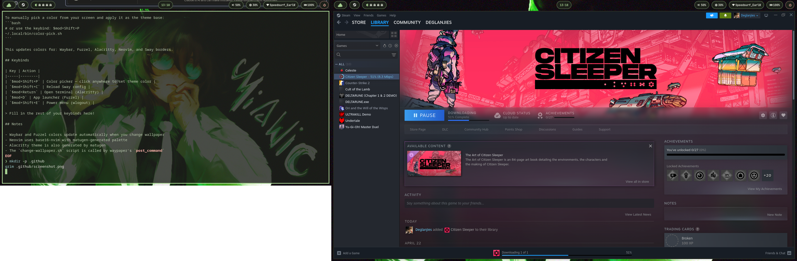

# sway-scroll dotfiles

My personal dotfiles for a Sway WM setup on EndeavourOS.



## What's included

- **Sway** — window manager config with keybinds, rules, autostart
- **Waybar** — pill-style bar with workspaces, clock, volume, brightness, network, power
- **Fuzzel** — app launcher
- **Matugen** — material you color generation from wallpaper or color picker
- **Waypaper** — wallpaper manager (swaybg backend)
- **Mako** — notifications
- **Wob** — volume/brightness overlay bar
- **Fish** — shell config
- **Zsh** — shell config
- **Fastfetch** — system info
- **Nvim** — LazyVim with matugen color integration
- **Scripts** — color picker, wallpaper changer

## Dependencies

Install everything with yay:

```bash
yay -S sway swaybg swaylock sway-scroll \
       waybar fuzzel mako wob \
       waypaper matugen \
       alacritty fish zsh \
       fastfetch neovim \
       grim slurp imagemagick \
       brightnessctl wireplumber \
       nm-connection-editor \
       wlogout fuzzel \
       ttf-jetbrains-mono-nerd
```

## Installation

> **Warning**: Back up your existing configs before doing this.

**1. Clone the repo:**

```bash
git clone https://github.com/yourusername/sway-scroll.git
cd sway-scroll
```

**2. Copy configs:**

```bash
# create dirs
mkdir -p ~/.config/{sway,waybar/scroll,fuzzel,matugen,mako,wob,waypaper,fastfetch,nvim}
mkdir -p ~/.local/bin

# sway
cp sway/config ~/.config/sway/config

# waybar
cp waybar/scroll/config.jsonc ~/.config/waybar/scroll/
cp waybar/scroll/style.css ~/.config/waybar/scroll/

# fuzzel
cp fuzzel/fuzzel.ini ~/.config/fuzzel/
cp fuzzel/colors.ini ~/.config/fuzzel/

# matugen
cp matugen/config.toml ~/.config/matugen/
cp matugen/*.template ~/.config/matugen/

# nvim
cp -r nvim/* ~/.config/nvim/

# mako
cp mako/config ~/.config/mako/

# waypaper
cp waypaper/config.ini ~/.config/waypaper/

# fastfetch
cp fastfetch/* ~/.config/fastfetch/

# zsh
cp zsh/.zshrc ~/
cp zsh/.zprofile ~/ 2>/dev/null

# fish
cp fish/* ~/.config/fish/

# scripts
cp scripts/change-wallpaper.sh ~/.local/bin/
cp scripts/color-pick.sh ~/.local/bin/
chmod +x ~/.local/bin/change-wallpaper.sh
chmod +x ~/.local/bin/color-pick.sh
```

**3. Generate initial colors:**

```bash
matugen image ~/Pictures/Wallpapers/your-wallpaper.jpg
```

**4. Start Sway:**

```bash
sway
```

## Color theming

Colors are generated automatically from your wallpaper using [matugen](https://github.com/InioX/matugen).

To change your wallpaper and update all colors:
```bash
waypaper
```

To manually pick a color from your screen and apply it as the theme base:
```bash
# or use the keybind: $mod+Shift+P
~/.local/bin/color-pick.sh
```

This updates colors for: Waybar, Fuzzel, Alacritty, Neovim, and Sway borders.

## Keybinds

| Key | Action |
|-----|--------|
| `$mod+Shift+P` | Color picker — click anywhere to set theme color |
| `$mod+Shift+C` | Reload Sway config |
| `$mod+Return` | Open terminal (Alacritty) |
| `$mod+D` | App launcher (Fuzzel) |
| `$mod+Shift+E` | Power menu (wlogout) |

> Fill in the rest of your keybinds here!

## Notes

- Waybar and Fuzzel colors update automatically when you change wallpaper
- Neovim uses base16-nvim with matugen-generated palette
- Alacritty theme is also generated by matugen
- The `change-wallpaper.sh` script is called by waypaper's `post_command`
